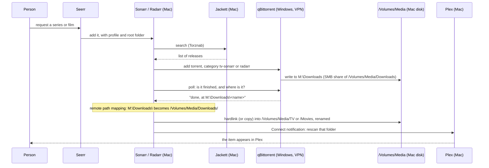

# Media stack overview: Plex, Sonarr, Radarr, an indexer manager, qBittorrent and Seerr

You end up with a home media library that fills itself: someone asks for a series or a film in Seerr, Sonarr or Radarr finds a release on your indexers, qBittorrent downloads it on a separate PC behind a VPN, and the finished file appears in Plex, named and sorted. This page explains how the pieces connect, which addresses and ports they use, how files get from one machine to the other, and what breaks when the downloader is not on the same computer as everything else. The detailed setup of each app is on its own page.

Write and use this for media you have the right to download and keep.

Example addresses and names are explained in [Conventions](../start-here/conventions.md); substitute your own.

| | |
| --- | --- |
| **Applies to** | Observed on a working build: Plex Media Server 1.43.4.10903, Sonarr 4.0.20.3014, Radarr 6.4.4.10685 and Jackett v0.24.2756 as native apps on an Intel Mac running macOS 26; qBittorrent v5.1.0 on a Windows PC bound to a VPN app's network adapter; Seerr on a k3s cluster behind a Cloudflare tunnel |
| **Also works for** | Apple Silicon Macs (each project ships an arm64 build), Prowlarr instead of Jackett, a Linux or Docker downloader. These variants were **not tested by the author** |
| **Time** | Reading: 20 minutes. Building the whole stack from the pages listed below: an afternoon |
| **You need first** | A Mac that stays on, with the media disk attached; a Windows PC for the downloader; a VPN subscription whose app runs on Windows; optionally [Pi-hole](pihole.md) for local names and [Seerr](seerr-cloudflare-tunnel.md) for requests |

## How it works

### The parts

| App | What it does | Runs on (this build) | Page |
| --- | --- | --- | --- |
| **Plex Media Server** | Scans the library folders, fetches artwork and descriptions, and streams to TVs, phones and browsers | Mac `media-1` | [Plex Media Server](plex-media-server.md) |
| **Sonarr** | Keeps a list of wanted TV series. Watches the indexers for new episodes, sends them to the downloader, then renames and files the result | Mac `media-1` | [Sonarr and Radarr](sonarr-and-radarr.md) |
| **Radarr** | The same for films | Mac `media-1` | [Sonarr and Radarr](sonarr-and-radarr.md) |
| **Jackett** or **Prowlarr** | Indexer managers. They talk to each of your indexers (sites or services that list releases) and offer them to Sonarr and Radarr in one standard format, called Torznab | Mac `media-1` (Jackett) | [Jackett and Prowlarr](jackett-and-prowlarr.md) |
| **qBittorrent** | The download client. Sonarr and Radarr hand it a torrent and a category; it downloads and seeds | Windows PC `torrent-pc`, behind the VPN | [qBittorrent on Windows behind a VPN](qbittorrent-windows-vpn.md) |
| **Seerr** | A request site for the household. A request becomes an entry in Sonarr or Radarr | k3s cluster, published through a Cloudflare tunnel | [Seerr](seerr-cloudflare-tunnel.md) |

Seerr is the successor of Overseerr and Jellyseerr; older guides call it Overseerr.

### How a request flows



1. Seerr adds the item to Sonarr (series) or Radarr (films) with a quality profile and a root folder (the top-level library folder it should end up in).
2. Sonarr or Radarr searches every enabled indexer through Jackett, picks the best release that matches the profile, and sends it to qBittorrent with a **category** (`tv-sonarr` or `radarr`). The category is how each app later recognises its own downloads.
3. qBittorrent downloads through the VPN and writes the files to its save folder. Here that folder is a network share on the Mac, mapped on Windows as drive `M:`.
4. Sonarr or Radarr keeps asking qBittorrent for the state of its category. When a download is complete, qBittorrent reports where it is, **in Windows terms**: `M:\Downloads\<name>`.
5. A remote path mapping translates that into the Mac's path, `/Volumes/Media/Downloads/<name>`. This step is what makes the split design work; see [Remote path mappings](#remote-path-mappings).
6. Sonarr or Radarr imports the file: it creates a renamed hardlink (or a copy) in the library folder and leaves the original for qBittorrent to keep seeding.
7. A Connect notification tells Plex to scan, and the item appears.

### The split design: apps on a Mac, downloader on a Windows PC behind a VPN

```
                        LAN 192.168.50.0/24
  ┌─────────────────────────────────┐        ┌───────────────────────────────┐
  │ media-1  192.168.50.2  (Mac)    │        │ torrent-pc 192.168.50.16 (Win)│
  │  Plex       :32400              │  HTTP  │  qBittorrent Web UI :8080     │
  │  Sonarr     :8989   ────────────┼───────►│   (bound to LAN address)      │
  │  Radarr     :7878               │        │  torrent traffic bound to the │
  │  Jackett    :9117 (127.0.0.1)   │  SMB   │   VPN adapter ──► VPN ──► net │
  │  /Volumes/Media ◄───────────────┼────────┤  M:\ = \\media-1\Media share  │
  └──────────────┬──────────────────┘        └───────────────────────────────┘
                 │ ISP connection (no VPN): indexer searches, metadata, Plex remote access
```

Why split it:

- **The VPN only has to cover one machine.** The torrent PC runs a VPN app, and qBittorrent is bound to the VPN's network adapter. If the VPN drops, qBittorrent has no network at all, rather than falling back to the normal internet connection. The Mac keeps its ordinary connection, so Plex remote streaming, metadata downloads and updates are not slowed or blocked by the VPN.
- **The Mac holds the disks and the library.** Plex, Sonarr and Radarr read and write files locally, which is fast and makes hardlinks possible.
- **The Windows PC only needs the share.** qBittorrent writes over SMB (Windows file sharing) into a folder on the Mac's media disk.

What it costs:

- Paths differ between the two machines, so Sonarr and Radarr need [remote path mappings](#remote-path-mappings).
- Two machines must both be up, and the share must be connected on Windows, before anything imports.
- **Indexer searches do not go through the VPN.** Jackett runs on the Mac, so its traffic to your indexers leaves through the Mac's normal ISP connection. Only qBittorrent's own traffic uses the VPN. If you want the searches covered too, the indexer manager must run on the VPN machine or use a proxy; that was not done in the working build and is **not verified by the author**.

### Folder layout, and why one filesystem matters

Everything that Sonarr, Radarr and qBittorrent touch lives on **one volume** (one disk or partition) on the Mac:

```
/Volumes/Media/
├── Downloads/          qBittorrent's save folder. Shared over SMB; M:\Downloads on Windows
├── TV/                 Sonarr root folder, Plex "TV Shows" library
│   └── Series Name/Season 1/Series Name - S01E01 - Title Quality.mkv
└── Movies/             Radarr root folder, Plex "Movies" library
    └── Film Title (2005) {imdb-tt0000000}/Film Title (2005) Quality.mkv
```

- A **hardlink** is a second name for the same data on disk. The file in `Downloads` (still seeding) and the renamed file in `TV` are one set of blocks, so the import takes no extra space and no time. An **instant move** (atomic move) is the same idea for files you do not seed: the file is renamed into place instead of being copied.
- Both only work **inside one filesystem**. You cannot hardlink across separate disks, partitions, volumes or mounts, and you cannot hardlink a folder ([TRaSH Guides: Hardlinks and Instant Moves](https://trash-guides.info/File-and-Folder-Structure/Hardlinks-and-Instant-Moves/)). When a hardlink fails, Sonarr and Radarr fall back to a copy ([Sonarr FAQ](https://wiki.servarr.com/sonarr/faq), [Radarr settings](https://wiki.servarr.com/radarr/settings)): the import still works, but the file now takes twice the space until the torrent is removed.
- The format of the volume matters. exFAT, a format often used on new external drives, does not support hardlinks. APFS and Mac OS Extended do.
- The download folder and the library folders must be different folders. Never point qBittorrent at a library folder or a root folder at `Downloads`.

**Observed on a working build:** the Mac had two large external volumes. The download share was on the larger one. Each volume had its own `Shows` and `Movies` folder, set up as two root folders in Sonarr and Radarr and as two folders in each Plex library. Imports to the volume that holds the downloads were hardlinks; imports to the **other** volume were full copies. If you have two disks, the example becomes:

| Path | Same volume as `Downloads`? | Import is |
| --- | --- | --- |
| `/Volumes/Media/TV`, `/Volumes/Media/Movies` | Yes | Hardlink: instant, no extra space |
| `/Volumes/Media2/TV`, `/Volumes/Media2/Movies` | No | Copy: slow, double space while seeding |

Put new series and films on the volume with the downloads, and treat the second volume as overflow for finished, older items.

The common guides use the TRaSH layout, one `data` folder with `torrents/` and `media/` under it ([TRaSH Guides: folder structure](https://trash-guides.info/File-and-Folder-Structure/)). The layout above follows the same rule (one filesystem, downloads separate from media) with different folder names.

### Remote path mappings

Sonarr and Radarr never see the download through qBittorrent's eyes. They ask qBittorrent where a finished download is, and qBittorrent answers with its own path. On Windows, that answer is a drive letter path the Mac cannot open.

A remote path mapping is a find-and-replace for one download client host: "when `192.168.50.16` reports a path starting with `M:\Downloads\`, read it as `/Volumes/Media/Downloads/`". The TRaSH guide calls it a "dumb find" and replace ([TRaSH Guides: Remote Path Mappings](https://trash-guides.info/Radarr/Tips/Radarr-remote-path-mapping/)).

| Field (Settings > Download Clients > Remote Path Mappings) | Value | Notes |
| --- | --- | --- |
| Host | `192.168.50.16` | Exactly as typed in the download client's Host field. If the client is set up as `torrent.home.example.com`, the mapping must say that too |
| Remote Path | `M:\Downloads\` | What qBittorrent reports. Windows path, backslashes, trailing backslash |
| Local Path | `/Volumes/Media/Downloads/` | The same folder as seen on the Mac, trailing slash |

Set the same mapping in **both** Sonarr and Radarr. Each app has its own list.

> **Pitfall: case.** The Local Path must match the volume name's capitals exactly. The working build had `/Volumes/<name>/Downloads/` in one app and the same path with one capital letter different in the other. Both worked only because the Mac's volume uses the default APFS format, which ignores case. On a case-sensitive volume, the app whose spelling is wrong cannot find the file and the download sits at "waiting to import". Copy the path from Finder or `ls /Volumes` rather than typing it.

> **Pitfall: mapped drive letters.** A mapped drive such as `M:` exists only in the logged-in Windows session that mapped it. It worked in the working build because qBittorrent ran as an ordinary program in an interactive, logged-in session. If you run qBittorrent as a Windows service, it cannot see `M:`. The Servarr FAQ recommends UNC paths (`\\media-1\Media\Downloads`) in both the download client and the *arr apps ([Sonarr FAQ: Mapped Network Drives vs UNC Paths](https://wiki.servarr.com/sonarr/faq)). With a UNC save path the Remote Path becomes `\\media-1\Media\Downloads\`; **not verified by the author**.

### Ports

| Port | App | Listens on | Who needs to reach it |
| --- | --- | --- | --- |
| `32400` TCP | Plex Media Server | Mac, all addresses | Every player in the house; the internet if Remote Access is on (router forward) |
| `8989` | Sonarr | Mac | Your browser, Seerr |
| `7878` | Radarr | Mac | Your browser, Seerr |
| `9117` | Jackett | Mac | Sonarr and Radarr on the same Mac (`127.0.0.1`); your browser for setup |
| `9696` | Prowlarr (if used instead of Jackett) | Mac | Your browser; Prowlarr itself connects out to Sonarr and Radarr |
| `8080` | qBittorrent Web UI | Windows PC, LAN address only | Sonarr, Radarr, your browser. Never the internet |
| `5055` | Seerr | Inside its pod on k3s | Only Traefik; people use `https://request.example.com` ([Seerr](seerr-cloudflare-tunnel.md)) |

Only Plex's port is ever forwarded on the router. Sonarr, Radarr, Jackett and qBittorrent stay on the LAN.

### Local DNS names

Names are easier to remember than ports and addresses, and survive moving an app. With [Pi-hole](pihole.md), add service names to `dnsmasq.customDnsEntries` in [`files/pihole/values.yaml`](../../files/pihole/values.yaml):

```yaml
dnsmasq:
  customDnsEntries:
    - address=/plex.home.example.com/192.168.50.2
    - address=/shows.home.example.com/192.168.50.2
    - address=/movies.home.example.com/192.168.50.2
    - address=/torrent.home.example.com/192.168.50.16
```

Then run the helm upgrade command from the Pi-hole page. These names point straight at the machines, not at Traefik, because the apps run outside the cluster. The port stays in the address:

| Name | Opens |
| --- | --- |
| `http://plex.home.example.com:32400/web` | Plex |
| `http://shows.home.example.com:8989` | Sonarr |
| `http://movies.home.example.com:7878` | Radarr |
| `http://torrent.home.example.com:8080` | qBittorrent |

> **Pitfall:** Sonarr and Radarr held an `allowedHosts` value in their host settings listing the names and addresses they were reached by (for example `shows`, `192.168.50.2` and the Mac's IPv6 address). qBittorrent has its own host header validation. If a new name gives an error page while the address works, add the name to that list. The exact behaviour of `allowedHosts` is **not verified by the author**.

Inside the apps, prefer addresses (`192.168.50.2`, `192.168.50.16`, `127.0.0.1`) over names for the connections between them. Then a Pi-hole outage does not stop downloads or imports.

### How this differs from the common guides

Most community guides run every app in Docker on one Linux host, or every app natively on one Windows PC. Three of them are listed under [References](#references). This build differs:

| Topic | Typical guide | This build |
| --- | --- | --- |
| Where apps run | All on one machine, often Docker containers | Native macOS apps on one Mac; qBittorrent on a separate Windows PC |
| VPN | A downloader container with a built-in VPN (for example `qbittorrentvpn`), or none | A VPN app on Windows; qBittorrent bound to its adapter |
| Paths | One `/data` mount shared by every container, so every app sees the same path | Two operating systems, two path styles; remote path mappings bridge them |
| Hardlinks | Work as long as `/data` is one mount | Work only for root folders on the same Mac volume as the download share |
| Indexer manager traffic | Often inside the VPN container's network | Leaves through the Mac's normal connection |
| Seerr / Overseerr | A container next to the others | A pod on k3s, published through a Cloudflare tunnel |
| Seeding vs. library copy | Some Windows guides copy files and keep both until seeding ends | Hardlinks on the same volume, so no second copy |

## Before you start

| Decide or gather | Notes |
| --- | --- |
| The media Mac and its fixed address | `media-1`, `192.168.50.2`. Wired Ethernet. Set the address on the Mac or reserve it on the router; Sonarr, Radarr, Seerr and the router's port forward all point at it |
| The torrent PC and its fixed address | `torrent-pc`, `192.168.50.16`. The download client settings and the remote path mappings use this address |
| Which volume holds the downloads | It must be the volume your main root folders are on. Here `/Volumes/Media` |
| Volume format | APFS or Mac OS Extended, not exFAT. Check with `diskutil info /Volumes/Media \| grep -i "File System"` |
| The share | `/Volumes/Media/Downloads` shared from the Mac over SMB, mapped on Windows as `M:\Downloads` (or used as a UNC path) |
| Jackett or Prowlarr | See [Jackett and Prowlarr](jackett-and-prowlarr.md). The working build uses Jackett |
| A VPN that allows torrent traffic | The app must have a way to bind to or block traffic outside its tunnel. See [qBittorrent on Windows behind a VPN](qbittorrent-windows-vpn.md) |
| Your rights to the media | Only download what you are entitled to |

## Steps

Build in this order. Each page stands on its own; this is only the sequence that avoids going back.

### Step 1. Prepare the Mac and install Plex

Follow [Plex Media Server](plex-media-server.md): stop the Mac sleeping, make it restart after a power cut, attach the media volume, create `/Volumes/Media/TV`, `/Volumes/Media/Movies` and `/Volumes/Media/Downloads`, then install and claim Plex and add the two libraries.

### Step 2. Set up the downloader

Follow [qBittorrent on Windows behind a VPN](qbittorrent-windows-vpn.md): share `/Volumes/Media/Downloads` from the Mac, map it on the PC, install the VPN app and qBittorrent, bind qBittorrent to the VPN adapter, set the save path to `M:\Downloads`, and open the Web UI on `192.168.50.16:8080`.

### Step 3. Set up the indexer manager

Follow [Jackett and Prowlarr](jackett-and-prowlarr.md) and add your indexers.

### Step 4. Set up Sonarr and Radarr

Follow [Sonarr and Radarr](sonarr-and-radarr.md): root folders, qBittorrent as download client, the remote path mapping, indexers, naming, and the Plex connection.

### Step 5. Add requests

Follow [Seerr](seerr-cloudflare-tunnel.md) and connect it to Plex, Sonarr and Radarr.

### Step 6. Add the names

Add the local DNS names above, if you use Pi-hole.

## Check it

Two read-only scripts in this repo check the stack from each side. They change nothing and print no keys or passwords. Read the comment block at the top of each one first.

| Script | Run on | What it checks | Status |
| --- | --- | --- | --- |
| [`files/media/media-health.sh`](../../files/media/media-health.sh) | the Mac `media-1`, as the user that runs the apps | The apps answer, their health lists, the volumes are mounted, free space, the download folder, and that qBittorrent's Web UI is reachable. It reads each app's API key from the app's own config file on the Mac | Tested against a mock API on Linux only; **not yet run on a Mac by the author** |
| [`files/media/qbit-check.ps1`](../../files/media/qbit-check.ps1) | the Windows PC `torrent-pc`, as the user that runs qBittorrent | qBittorrent is running, its settings, the VPN adapter binding, the save path and the Web UI | Parse-checked only; **not yet run by the author** |

**Run on: the Mac**, from the root of this repo. Settings such as the qBittorrent address and the volumes can be overridden with environment variables; the defaults are the example values.

```sh
bash files/media/media-health.sh
QBIT_HOST=192.168.50.16 VOLUMES="/Volumes/Media /Volumes/Media2" bash files/media/media-health.sh
```

**Run on: the Windows PC**, in PowerShell, from the root of this repo. `-VpnAdapter` is the start of your VPN app's adapter name as `Get-NetAdapter` shows it.

```powershell
powershell -ExecutionPolicy Bypass -File .\files\media\qbit-check.ps1 -VpnAdapter "<VPN_ADAPTER_NAME>" -SavePath "M:\Downloads" -MediaServer 192.168.50.2
```

By hand, end to end:

| Test | Where | Pass |
| --- | --- | --- |
| `curl -s -o /dev/null -w '%{http_code}\n' http://192.168.50.16:8080/` | the Mac | `200`: the Mac can reach qBittorrent's Web UI |
| `ls /Volumes/Media/Downloads` | the Mac | Lists what qBittorrent has downloaded |
| `dir M:\Downloads` | the Windows PC | Lists the same files |
| Sonarr and Radarr: System > Status, Health | browser | No download client or remote path mapping messages |
| Sonarr and Radarr: Settings > Download Clients > qBittorrent > Test | browser | Green tick |
| Request something small in Seerr | browser | It shows in Sonarr or Radarr, then in qBittorrent under its category, then in Plex after import |
| `ls -li /Volumes/Media/Downloads/<file> /Volumes/Media/TV/<series>/<season>/<file>` | the Mac | Both lines start with the **same inode number**: the import was a hardlink |

## Pitfalls

| What happens | Why | Avoid or recover |
| --- | --- | --- |
| Downloads finish but never import; the queue shows "Downloaded - waiting to import" or a remote path error | No remote path mapping, a mapping for the wrong host (address in one place, name in the other), or a typo in the path | Add or correct the mapping in **both** apps. Host must match the download client's Host field exactly |
| One app imports, the other does not | The mappings differ, for example in the case of the volume name | Copy the working mapping into the other app; check case on a case-sensitive volume |
| Imports work, but the disk fills twice as fast as expected | The root folder is on another volume from `Downloads`, so every import is a copy | Keep the main root folders on the download volume. Check with `ls -li` (same inode means hardlink) |
| Nothing imports after the Windows PC restarts | The `M:` drive was not reconnected before qBittorrent started, or qBittorrent runs as a service and cannot see mapped drives. Downloads may land on a local disk instead | Reconnect at sign-in, start qBittorrent after the share is mapped, or use UNC paths. See [qBittorrent on Windows behind a VPN](qbittorrent-windows-vpn.md) |
| Everything stops after the Mac restarts | The apps run in a user session; nobody is logged in, or the external volume is not mounted yet | See the Mac preparation in [Plex Media Server](plex-media-server.md) |
| Searches work but some indexers fail every time | Indexer problems are on the Mac side, outside the VPN | See [Jackett and Prowlarr](jackett-and-prowlarr.md) |
| You believe searches are private, but they are not | The indexer manager runs on the Mac, outside the VPN | Know which traffic the VPN covers; move the indexer manager if that matters to you |
| qBittorrent's Web UI port appears as an open port on your public address | qBittorrent's "use UPnP / NAT-PMP to forward the port from my router" for the Web UI was on, and the router accepts UPnP requests | Turn that off in qBittorrent, and prefer static forwards with UPnP off on the router. See [qBittorrent on Windows behind a VPN](qbittorrent-windows-vpn.md) |
| Sonarr or Radarr loses the download client after the PC gets a new address | The PC's address came from DHCP without a reservation | Fix the address; then update the download client Host **and** the remote path mapping Host |

## Troubleshooting

| Symptom | Cause | Fix |
| --- | --- | --- |
| Download client test fails: cannot connect | qBittorrent not running, Web UI bound to another address, Windows firewall, or the VPN app blocking LAN traffic | On the PC: is qBittorrent open? Run `qbit-check.ps1`. Check the VPN app's "allow LAN connections" setting and the Windows firewall rule for port 8080 |
| Download client test fails: unauthorised or banned | Wrong user/password, or too many failed logins and the Mac's address was banned | Correct the credentials; wait for the ban time or restart qBittorrent |
| "Bad Remote Path Mapping" or "Remote Path is Used and Import Failed" in Health | The mapping does not produce a path the app can read | [Sonarr: Bad Remote Path Mapping](https://wiki.servarr.com/sonarr/system#bad-remote-path-mapping), [Remote Path is Used and Import Failed](https://wiki.servarr.com/sonarr/system#remote-path-is-used-and-import-failed). Check that `ls /Volumes/Media/Downloads` on the Mac shows the download |
| Files appear in qBittorrent but not in `/Volumes/Media/Downloads` | qBittorrent saved them somewhere else (a local disk, or a category folder) | Check qBittorrent's save path and category save paths; see [qBittorrent on Windows behind a VPN](qbittorrent-windows-vpn.md) |
| Imports are copies (two inode numbers) | Root folder and downloads on different volumes, or an exFAT volume | Same volume, APFS or Mac OS Extended |
| An item imported but Plex does not show it | No Plex Connect notification, or the library does not include that root folder | Add the folder to the Plex library; add the Connect entry ([Sonarr and Radarr](sonarr-and-radarr.md)) |
| Seerr says the item is requested, nothing happens | Sonarr/Radarr has no working indexers or search is off for them | Sonarr/Radarr System > Status; [Sonarr and Radarr](sonarr-and-radarr.md) troubleshooting |
| A name such as `shows.home.example.com` does not resolve | The Pi-hole entry is missing, or the device does not use Pi-hole | `nslookup shows.home.example.com 192.168.50.11` |

## References

- [TRaSH Guides: Hardlinks and Instant Moves](https://trash-guides.info/File-and-Folder-Structure/Hardlinks-and-Instant-Moves/): what hardlinks and atomic moves are and why they need one filesystem. The pages showed a "Docs built by Pull Request" banner when checked; recheck the content.
- [TRaSH Guides: File and Folder Structure](https://trash-guides.info/File-and-Folder-Structure/): the common single `data` folder layout.
- [TRaSH Guides: Remote Path Mappings](https://trash-guides.info/Radarr/Tips/Radarr-remote-path-mapping/): when and how to map a download client's path to the app's path.
- [Servarr wiki: Docker Guide](https://wiki.servarr.com/docker-guide): why separate mounts break hardlinks and when a remote path map is needed.
- [Sonarr FAQ](https://wiki.servarr.com/sonarr/faq): mapped network drives versus UNC paths, and why there are two files while seeding.
- [Sonarr System (health checks)](https://wiki.servarr.com/sonarr/system): the health messages for download clients and remote path mappings.
- [Rafael Magalhaes: Home media server with Plex, Sonarr, Radarr, qBittorrent and Overseerr](https://dev.to/rafaelmagalhaes/home-media-server-with-plex-sonarr-radarr-qbitorrent-and-overseerr-2a84): a native Windows build on one PC (also on [Medium](https://medium.com/@rafaelmagalhaes93/home-media-server-with-plex-sonarr-radarr-qbitorrent-and-overseerr-fec90f623777)).
- [How to setup Plex with Sonarr, Radarr, Jackett, Overseerr and qBitTorrent using Docker](https://gist.github.com/rickklaasboer/b5c159833ff2971fccd32296d8ba2260): a Docker build on Ubuntu with a VPN downloader container and a later hardlinks section. Its author marks it as outdated.
