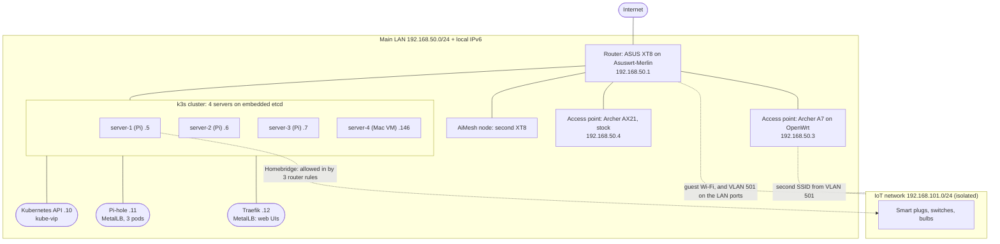

# Overview

This wiki describes one complete home setup and breaks it into modules you can use separately. This page shows how the modules fit together, so that you can tell which ones you need and in what order.

Example addresses and names are explained in [Conventions](conventions.md); substitute your own.

## The whole build on one page

## What each part does

| Part | Job | Guide |
| --- | --- | --- |
| Router | Internet, DHCP, Wi-Fi, the guest/IoT network, and forcing every device's DNS to Pi-hole | [ASUS ZenWiFi XT8](../hardware/asus-zenwifi-xt8.md) |
| AiMesh node | Extends the router's Wi-Fi, including the IoT network | [AiMesh node](../hardware/asus-aimesh-node.md) |
| OpenWrt access point | More Wi-Fi coverage; also broadcasts the IoT network as a second SSID | [Archer A7 on OpenWrt](../hardware/tp-link-archer-a7-openwrt.md) |
| Stock access point | More Wi-Fi coverage, nothing else | [Archer AX21](../hardware/tp-link-archer-ax21.md) |
| Cluster machines | Three Raspberry Pis and one Mac VM, all k3s servers | [Raspberry Pi](../hardware/raspberry-pi.md), [Mac in a Lima VM](../hardware/mac-lima-vm.md) |
| k3s | Runs the apps and restarts them elsewhere when a machine dies | [HA k3s cluster](../kubernetes/k3s-ha-cluster.md) |
| kube-vip | One address for the Kubernetes API that moves between the Pis | [Load balancers](../kubernetes/load-balancers.md) |
| MetalLB | Gives services their own LAN addresses (.11, .12) | [Load balancers](../kubernetes/load-balancers.md) |
| Traefik | One address for every web UI, by host name, with HTTPS | [Load balancers](../kubernetes/load-balancers.md) |
| CoreDNS | DNS inside the cluster | [CoreDNS](../kubernetes/coredns.md) |
| Pi-hole | DNS and ad-blocking for the house, three copies | [Pi-hole](../apps/pihole.md) |
| Homebridge | Brings non-HomeKit devices and cameras into Apple Home | [Homebridge](../apps/homebridge.md) |
| Seerr | Media request app, reachable from outside through a tunnel | [Seerr](../apps/seerr-cloudflare-tunnel.md) |

## The design decisions, and where each is explained

| Decision | Why | Where |
| --- | --- | --- |
| Pi-hole is the only DNS server devices are given, and the router redirects anything that tries another | One place to block, name and log | [DNS design](../network/dns-design.md) |
| Cluster nodes use outside DNS, never Pi-hole | A node must be able to start Pi-hole without Pi-hole | [DNS design](../network/dns-design.md), [Raspberry Pi](../hardware/raspberry-pi.md) |
| IoT devices live on their own isolated network | A cheap smart plug should not be able to reach a laptop | [Isolated IoT network](../network/isolated-iot-network.md) |
| The home-automation server may open connections into the IoT network, never the other way round | Control without exposure | [Isolated IoT network](../network/isolated-iot-network.md), [Kasa across networks](../apps/homebridge-kasa-across-networks.md) |
| Local IPv6 addresses but no IPv6 default route | Local IPv6 works; internet traffic stays on IPv4 because the ISP has no IPv6 | [Local-only IPv6](../network/local-only-ipv6.md) |
| Every cluster machine is a server on embedded etcd | Any one machine can fail | [HA k3s cluster](../kubernetes/k3s-ha-cluster.md) |
| k3s's built-in load balancer is off; MetalLB hands out addresses | The built-in one publishes services on every node and collides with MetalLB | [Load balancers](../kubernetes/load-balancers.md) |
| As few load-balancer addresses as possible; web apps share Traefik's | Less to track and to reserve | [Load balancers](../kubernetes/load-balancers.md) |
| Homebridge is a single pod on the node's own network | HomeKit pairs with one bridge identity; discovery needs the real LAN | [Homebridge](../apps/homebridge.md) |
| Anything addressed by IP gets a reservation; anything carried around stays dynamic; stationary Wi-Fi devices are exempt from roaming | Names and integrations keep working, and smart plugs stop being kicked between mesh units | [Address plan](../network/address-plan.md) |
| Access points only bridge: no routing, DHCP or firewall on them | One router makes every decision | [Archer A7](../hardware/tp-link-archer-a7-openwrt.md), [Archer AX21](../hardware/tp-link-archer-ax21.md) |

## The parts that cost the most time

If you are short of time, read these first. Each was a real, hard-to-find fault.

| Problem | Where it is written up |
| --- | --- |
| A server on the LAN could not reach devices on the ASUS guest network, although the firewall rules looked right. ASUS guest isolation is done in `ebtables`, not `iptables` | [Isolated IoT network](../network/isolated-iot-network.md) |
| The router sent no IPv6 advertisements. With IPv6 disabled in the UI, the firmware's IPv6 OUTPUT policy is DROP | [Local-only IPv6](../network/local-only-ipv6.md) |
| The built-in k3s load balancer took addresses meant for MetalLB | [Load balancers](../kubernetes/load-balancers.md) |
| Nodes that used Pi-hole for their own DNS could not pull the Pi-hole image after a restart | [DNS design](../network/dns-design.md) |
| A host-network pod on a dual-stack cluster failed DNS lookups a few times an hour (`getaddrinfo ENOTFOUND`) | [CoreDNS](../kubernetes/coredns.md), [Homebridge](../apps/homebridge.md) |
| Pi-hole's web UI logged in and immediately logged out with three pods | [Pi-hole](../apps/pihole.md) |
| Leftover `server` folders stopped the conversion to embedded etcd | [HA k3s cluster](../kubernetes/k3s-ha-cluster.md) |
| A Mac VM joined the cluster on the wrong interface and under the wrong name | [Mac in a Lima VM](../hardware/mac-lima-vm.md) |
| A Cloudflare tunnel returned 502 after Traefik moved to its own address | [Seerr](../apps/seerr-cloudflare-tunnel.md) |
| The router log grew to 25 MB because log rotation had been failing silently every night | [Router logging](../network/router-logging.md) |
| Home names did not resolve on a laptop with a corporate VPN | [Client devices](../apps/client-devices.md) |

## What you can leave out

| If you do not have or want | Skip | Nothing else changes except |
| --- | --- | --- |
| IPv6 | [Local-only IPv6](../network/local-only-ipv6.md) | Use an IPv4-only k3s config and drop the IPv6 pool and addresses from MetalLB and Pi-hole; the pages say where |
| An IoT network | [Isolated IoT network](../network/isolated-iot-network.md), [Kasa across networks](../apps/homebridge-kasa-across-networks.md) | Homebridge reaches devices on the LAN directly |
| A mesh node or extra access points | Those hardware pages | Nothing |
| The Mac | [Mac in a Lima VM](../hardware/mac-lima-vm.md) | Three servers is already a complete highly available cluster |
| A cluster at all | Everything under Kubernetes and Apps | The router, access point, IoT and logging pages still apply |
| ASUS hardware | The two ASUS pages | The ideas in [DNS design](../network/dns-design.md) and [Local-only IPv6](../network/local-only-ipv6.md) carry over, but the commands are Asuswrt-Merlin specific |
